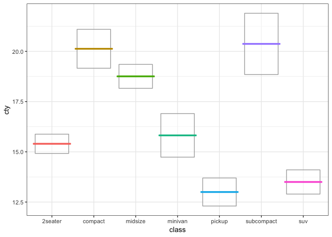
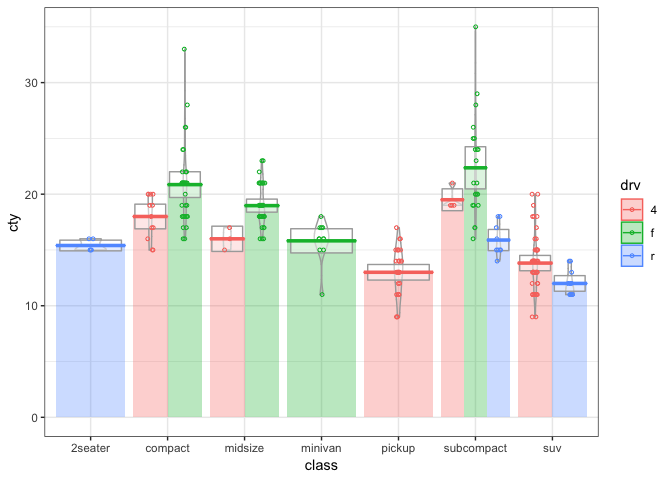

<!-- README.md is generated from README.Rmd. Please edit that file -->
ggpirate
========

A [pirate plot](https://cran.r-project.org/web/packages/yarrr/vignettes/pirateplot.html) is a way of displaying data where a continuous dependent variable is a function of a categorical independent variable, in a more informative way than the traditional barplot. `geom_pirate()` plots the raw data as points (using `ggplot2::geom_jitter()`), along with layers showing descriptive and inferential statistics -- bars indicating means (using `ggplot2::geom_col()`), horizontal line indicating means (using `ggplot2::geom_crossbar()`), boxes indicating 95% confidence intervals assuming a normal sampling distribution (using `ggplot2::geom_tile()`), and violins indicating the density (using `ggplot2::geom_violin()`).

Installation
------------

You can install ggpirate from github with:

``` r
# install.packages("devtools")
devtools::install_github("mikabr/ggpirate")
```

Examples
========

``` r
library(ggpirate)
theme_set(theme_bw())
```

Colour pirate plot:

``` r
ggplot(mpg, aes(x = class, y = cty)) +
  geom_pirate(aes(colour = class))
```


    #> $na.rm
    #> [1] FALSE

Each of the layers can be turned off, e.g. for just means and confidence intervals:

``` r
ggplot(mpg, aes(x = class, y = cty)) +
  geom_pirate(aes(colour = class), points = FALSE, bars = FALSE, violins = FALSE)
```



    #> $na.rm
    #> [1] FALSE

Colour can be mapped to a different variable than the x axis, resulting in dodged subgroups:

``` r
mpg2 <- dplyr::mutate(mpg, drv = factor(drv))

ggplot(mpg2, aes(x = class, y = cty)) +
  geom_pirate(aes(colour = drv), show.legend = TRUE)
```



    #> $na.rm
    #> [1] FALSE

And it plays well with facetting:

``` r
mpg_gather <- tidyr::gather(mpg, type, mileage, cty, hwy)

ggplot(mpg_gather, aes(x = class, y = mileage)) +
  facet_wrap(~type) +
  geom_pirate(aes(colour = class))
```


    #> $na.rm
    #> [1] FALSE

Finally, the parameters passed to any of the layers can be adjusted, e.g.:

``` r
ggplot(mpg, aes(x = class, y = cty)) +
  geom_pirate(aes(colour = class), bars = FALSE,
              points_params = list(shape = 19, alpha = 0.2),
              lines_params = list(size = 0.8))
```


    #> $na.rm
    #> [1] FALSE
